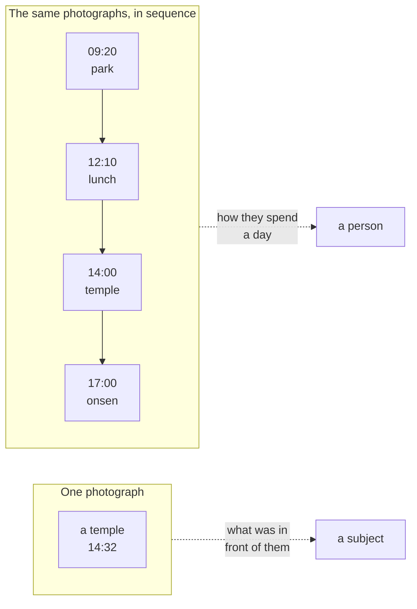
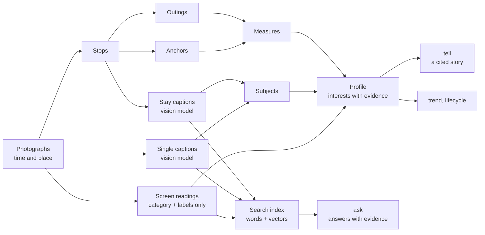
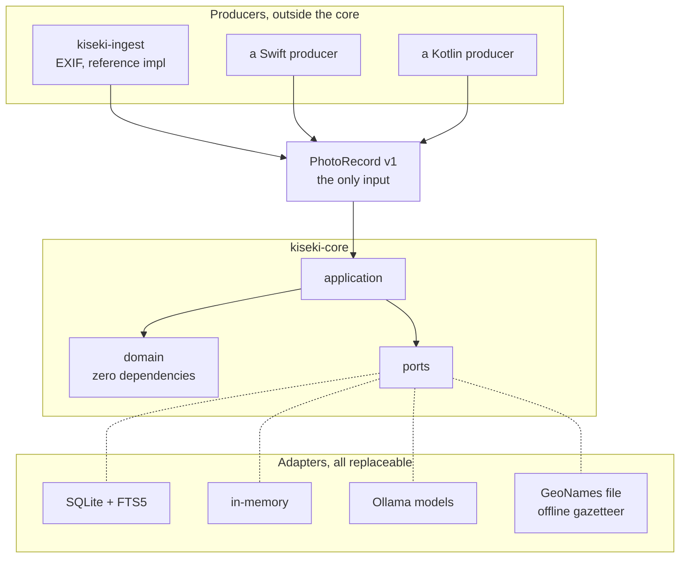
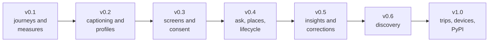

# KISEKI

**Your photo library already knows what you like. KISEKI reads it -- on your
machine, for you alone.**

A Python library. No account, no upload, no network required.

*Kiseki* means "trail" in Japanese: the line your days draw on a map. This
library reads that line.

---

## Why this exists

Every recommendation you meet today is somebody's average: what people like
you clicked, what an advertiser paid for, what is popular this week. None of
it knows that you photograph every bowl of ramen, that you go back to the same
riverside every few weeks, or that last spring you suddenly started
photographing gardens.

Your photo library knows all of that. It is the most honest diary nobody
writes: where you actually went, what you actually stopped for, what you
found worth keeping.

KISEKI's long-term vision is an assistant that can answer *"where should I go
on my next day off?"* from who you actually are -- with the evidence to prove
it, and without your life ever leaving your machine. The versions below build
toward that: first measure the trail, then read it as interests, then let you
question it, correct it, and finally act on it.

---

## The idea

Ask what a photograph says about someone and you get an answer about its
subject. Ask what a thousand photographs say *in order* and you get an answer
about the photographer.



The second reading is what this library is for. Not *where did they go*, but
*how far do they usually go, how much do they pack into a day, which places
were worth a second visit -- and what does all of that say about what they
like*.

---

## What it can do today

**Measure the journeys.** Photographs become stops, outings and anchors --
the places that look like a life -- with honest numbers and no categories:

```
places returned to
  (35.6581, 139.7017)    52 days   304 photos   night   6%  weekday 100%
  (35.7148, 139.7967)    12 days    61 photos   night   8%  weekday  33%

distinct places      131        never returned to    85%
distance covered     median 0.0 km   mean 16.7   range 0.0 to 817.1
```

You can read those places without being told which is which. That is
deliberate: the library reports what it observed and assigns no labels,
because the categories that fit one person's life fit the next person's
badly ([ADR-0012](docs/adr/0012-anchors-are-observations-not-categories.md)).

**Read the interests.** Local vision and language models caption the stays
and the lone photographs, name their subjects, and merge everything --
journeys, subjects, screenshots -- into one profile where every interest
carries its evidence and a confidence.

**Tell the story.** `kiseki tell` narrates the profile in Japanese or
English, citing a numbered fact for every claim. Places speak by name (from
an offline gazetteer you download yourself), together with what you
photographed right there.

**Answer questions.** `kiseki ask "What did I keep eating last year?"`
retrieves your own captions by words and by meaning, hands the model a closed
fact list, and returns an answer contract: the answer, the evidence, its time
range, and a confidence derived from the retrieval -- never from the model.
"Last year" and its Japanese equivalents become the time window
automatically.

**Watch it move.** `kiseki trend` reads the drift between kept profiles;
`kiseki lifecycle` reads where each topic stands in its life -- new,
returned, growing, declining, dormant, stable. Both are derived on demand and
stored nowhere.

**Look at it.** `kiseki view` writes one self-contained HTML page -- density
map on the blur grid, top interests, rhythm, drift -- that talks to no one.

---

## How it works



A **stop** is a stay in one place, found from photograph density and the
speed implied between shots. An **outing** is a run of stops with no long
silence between them. An **anchor** is anywhere visited on enough separate
days to be part of a life. **Measures** count and never interpret
([ADR-0010](docs/adr/0010-separate-measurement-from-interpretation.md));
everything that interprets sits above them and cites its evidence.

The models are local (Ollama): a vision model describes, a language model
phrases, an embedding model indexes. Every model stage is resumable, and
every narrated or answered word rests on a numbered fact the model was
given -- it cannot make an answer more certain than the evidence is.

---

## Architecture



Three commitments, each enforced rather than promised:

**The domain layer depends on nothing.** Not Pillow, not a database, not even
`pathlib`. `kiseki-core` declares no runtime dependencies at all, and
import-linter fails the build if anything creeps in.

**One documented input.** The core never reads EXIF, HEIC, PhotoKit or
MediaStore. It accepts [PhotoRecord v1](docs/photo-record.md), a JSON contract
any program in any language can emit. A
[conformance kit](docs/conformance.md) checks your producer against it, and a
contract forbids the reference producer from importing the core, so the
independence is verified rather than asserted.

**Ports are protocols.** Storage, models and the gazetteer are
`typing.Protocol`, so an implementer writes a matching class and never
imports this library. One shared test suite runs against both the fake and
the real implementation, so the fake cannot drift.
See [ADR-0004](docs/adr/0004-define-ports-as-protocols.md).

---

## Privacy

The premise requires holding someone's movements for years, so the position
is structural rather than a promise:

- **No coordinate is ever configured.** Home is not a setting; it is
  inferred, or not inferred, from evidence
- **Nothing leaves the machine.** No network call is needed to ingest, build,
  index, ask or report; even place names come from a file you download
  yourself
- **No personal data in this repository.** Tests build synthetic photographs
  at run time; a pre-commit hook refuses to commit an image or a database
- **Coordinate blurring is the default** on everything served or written: the
  local API and the HTML view round to about a kilometre unless raw output is
  asked for explicitly
- **Screenshot words are never stored**: a screen reading is a category and
  short labels, with no text field; chat, auth and finance screens are never
  labelled, and consent flags are enforced in code (ADR-0030, ADR-0032)
- **Anchors are never named, and names are never stored**: the gazetteer
  resolves place names at display time only, and the served story keeps
  places silent (ADR-0040, ADR-0041)

---

## Try it

```bash
git clone https://github.com/Nananananana/kiseki
cd kiseki
uv sync --all-packages

# turn a folder of photographs into the input contract
uv run kiseki-ingest ~/photos ~/kiseki-data \
  --owner me --platform ios --default-offset +09:00

# read them, build, and see what they say
uv run kiseki ingest ~/kiseki-data/photo-records.json
uv run kiseki build
uv run kiseki report
uv run kiseki caption    # describe each stay with a local vision model
uv run kiseki singles    # caption the photographs outside every stay
uv run kiseki screens    # read the screenshots: category and labels only
uv run kiseki subjects   # name what the captions were about
uv run kiseki themes     # gather the subject labels into themes
uv run kiseki profile    # read the measures and subjects as interests
uv run kiseki tell       # a cited narration of the profile
uv run kiseki index      # index the readings for search
uv run kiseki ask "What do I keep photographing lately?"
uv run kiseki trend      # the drift between kept profiles
uv run kiseki lifecycle  # where each topic stands in its life
uv run kiseki view       # one self-contained HTML view of it all
uv run kiseki serve      # the same answers over local HTTP
```

Full reference: [docs/cli.md](docs/cli.md). Place names need a one-time
download: [docs/gazetteer.md](docs/gazetteer.md). A weekly
`kiseki profile` is what feeds `trend` and `lifecycle`; the refresh routine
lives in [docs/runbook.md](docs/runbook.md).

---

## Roadmap



| Version | Scope | State |
|---|---|---|
| v0.1 | Stops, outings, anchors, measures, storage, CLI | Released |
| v0.2.x | Image captioning, written profiles, themes, trend, local API, visualisation | Released |
| v0.3 | Screenshots as interest evidence, the screen reader, mechanical consent | Released |
| v0.4 | Single-photo context, hybrid search and `ask`, temporal questions, named places, place narration, lifecycle labels | **Released** |
| v0.5 | The insight engine (deterministic findings, narrated with citations), user corrections (append-only, consent-shaped), profile comparison, timeline and explorer views, interest export, privacy dashboard and audit | Planned |
| v0.6 | Contradiction surfacing, returned-interest and discovery feeds -- the features that need a grown history | Planned |
| v1.0 | Overnight trips, weather, several devices merged, incremental rebuilds, PyPI | Planned |

The versions climb a longer ladder: **Phase 0** measure the trail (done),
**Phase 1** understand yourself (v0.4-v0.6), **Phase 2** recommendations with
evidence, **Phase 3** an anonymous interest community, **Phase 4** an
interest graph. Details: [docs/proposals](docs/proposals).

---

## Documents

- [Architecture decisions](docs/adr) -- 42 ADRs and counting; the reasoning
  lives here
- [CLI reference](docs/cli.md), [runbook](docs/runbook.md),
  [gazetteer](docs/gazetteer.md)
- [PhotoRecord v1](docs/photo-record.md) and the
  [conformance kit](docs/conformance.md)
- [Release notes](docs/releases)

## License

MIT. Place names come from [GeoNames](https://www.geonames.org/) data
(CC BY 4.0), downloaded by the user and never bundled.
