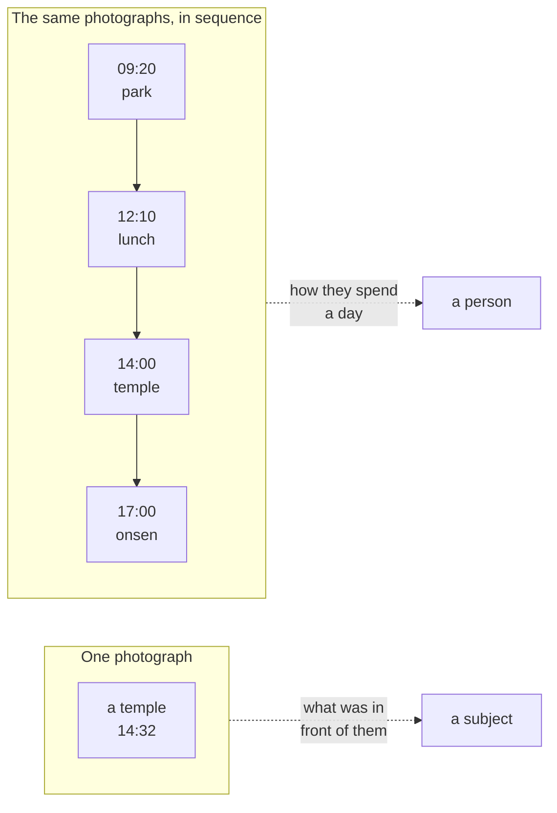
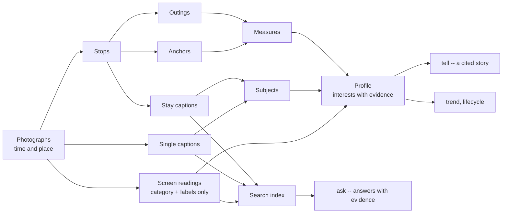
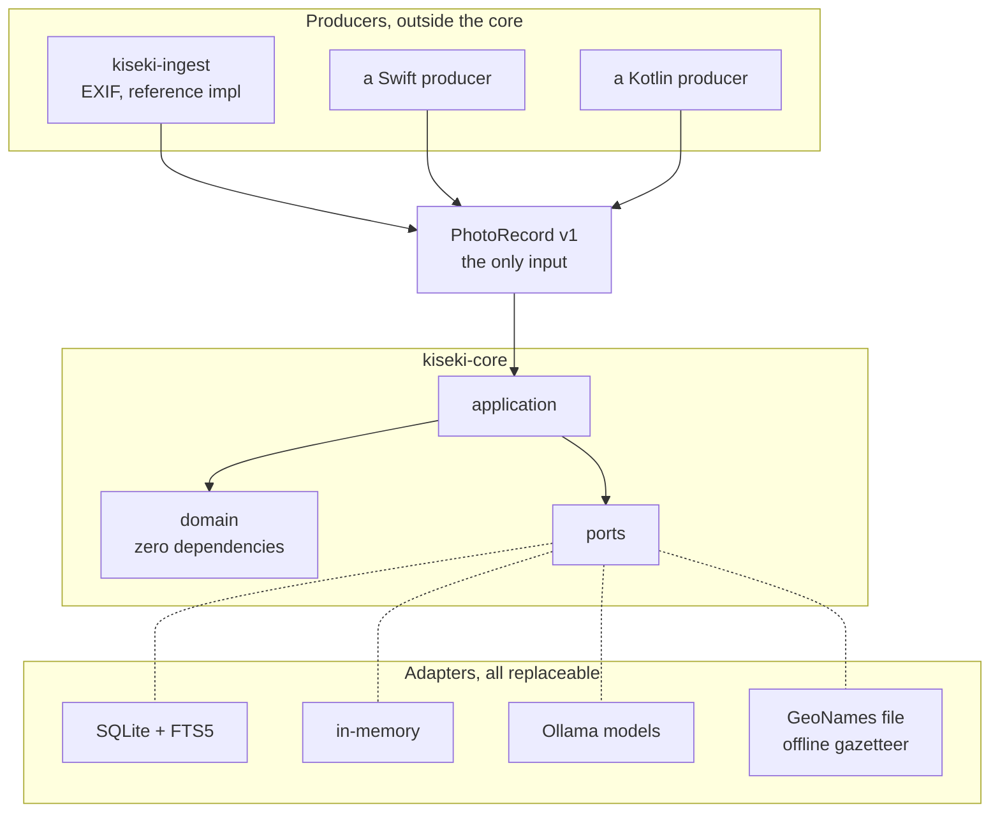

# KISEKI

**A local-first personal context engine: it turns your photo history into
evidence-backed insights about your journeys, your interests, and how they
change over time.**


**No account ﾂｷ No upload ﾂｷ No network required.**

*Kiseki* means "trail" in Japanese: the line your days draw on a map. This
library reads that line -- on your machine, for you alone.

---

## The problem

Your phone holds thousands of photographs, and today's photo AI is good at
them: it searches, classifies, recognises what is in the frame, shows where
it was taken. All of that is about the *photos*.

None of it answers the questions the photos could answer about *you*:

> Where do I keep going back? What do I actually care about? How do I spend
> a free day? What changed since last year -- and why do I think so?

| Traditional photo AI | KISEKI |
|---|---|
| What is in this photo? | What does my photo history say about me? |
| Find this photo | Understand my behaviour |
| Recognise objects | Discover interests |
| Group photos | Reconstruct journeys |
| Search by metadata | Search personal context |
| The current state | Change over time |

Not a replacement for those tools -- a different layer above them.

---

## What KISEKI does

```text
Photos -> Journeys -> Patterns -> Interests -> Personal context -> Insights
```

KISEKI does not simply classify your photos. It reconstructs patterns
across time:



One photograph tells you about its subject. A sequence tells you about the
photographer. The second reading is what this library is for.

---

## What can KISEKI tell you?

- Where do I keep going back?
- What kinds of places do I explore, and how far do I usually go?
- What interests appear to be growing? Which have faded -- or returned?
- What did I keep photographing last year?
- What changed compared with last year?
- And for every answer: **why does KISEKI think that?**

Every meaningful answer can point back to evidence: the photographs, stops
and readings it was derived from, with their time range.

---

## Example

Given two years of an ordinary photo library:

```text
distinct places      131        never returned to    85%
distance covered     median 0.0 km   mean 16.7   range 0.0 to 817.1
time out             median 1.0 h    mean  3.1
weekend share        37%
```

```text
$ kiseki ask "What did I keep eating last year?"
Ramen, again and again -- eight bowls photographed across the year,
most of them at counters [F1][F4].

  confidence    0.79
  window        2025-01-01 to 2025-12-31
  evidence      8
```

KISEKI does not decide what these numbers mean for you, and it assigns no
categories -- the ones that fit one person's life fit the next person's
badly ([ADR-0012](docs/adr/0012-anchors-are-observations-not-categories.md)).
It gives you the patterns, and the evidence they rest on.

---

## Quick start

```bash
git clone https://github.com/Nananananana/kiseki
cd kiseki
uv sync --all-packages

# turn a folder of photographs into the input contract
uv run kiseki-ingest ~/photos ~/kiseki-data \
  --owner me --platform ios --default-offset +09:00

# read them, build, and see what they say
uv run kiseki ingest ~/kiseki-data/photo-records.json
uv run kiseki build
uv run kiseki report
```

What happens next:

```text
your photos -> PhotoRecord -> journeys -> measures -> profile
            -> interests -> trends and lifecycle -> answers
```

The full tour -- captioning, interests, stories, questions -- is under
[What you can do](#what-you-can-do) below.

---

## Three pillars

**Journey Intelligence** -- understand how you move through the world:
where you go, how often you return, how far you travel, how long you stay,
how densely you pack a day.

**Interest Intelligence** -- understand what you care about: subjects,
themes, the interests that recur, emerge and decline, and the places tied
to them.

**Memory Intelligence** -- understand how you change: kept profiles,
temporal questions ("last year..."), returned interests, lifecycles, and
comparisons across time.

```text
Journey + Interest + Memory
        -> Personal context
        -> Insights
        -> Ask / Compare / Discover
        -> Suggest
```

That ladder is the roadmap: KISEKI is not a photo analysis library but a
personal context engine in the making.

---

## Evidence-first

KISEKI does not want to tell you what kind of person you are. It shows the
patterns in your data and lets you inspect the evidence behind them. Every
interest carries its evidence and a confidence; every narrated or answered
claim cites a numbered fact.

### AI's role

```text
Evidence -> deterministic measures -> derived profile and insights
         -> LLM narration
```

Local models (via Ollama) describe photographs and phrase answers. They
work over a closed, numbered fact list and must cite it. **The model
explains the evidence; it does not create facts outside it.** Confidence,
time ranges, trends and lifecycles are arithmetic, never model opinions --
and with no evidence there is no model call: "I don't know" is a correct
answer.

---

## Private by design

Your photo history can reveal where you live, where you work, where you
travel, and what you care about. KISEKI treats that as an architectural
constraint, not a feature added later:

- **No coordinate is ever configured.** Home is not a setting; it is
  inferred, or not inferred, from evidence
- **Nothing leaves the machine.** No network call is needed to ingest,
  build, index, ask or report; even place names come from a file you
  download yourself
- **No personal data in this repository.** Tests build synthetic
  photographs at run time; a pre-commit hook refuses images and databases
- **Coordinate blurring is the default** on everything served or written:
  the local API and the HTML view round to about a kilometre unless raw
  output is asked for explicitly
- **Screenshot words are never stored**: a screen reading is a category and
  short labels, with no text field; chat, auth and finance screens are
  never labelled, and consent flags are enforced in code (ADR-0030,
  ADR-0032)
- **Anchors are never named, and names are never stored**: the gazetteer
  resolves place names at display time only, and the served story keeps
  places silent (ADR-0040, ADR-0041)

---

## What you can do

**Core workflow**

```bash
uv run kiseki ingest ...     # read PhotoRecord files
uv run kiseki build          # stops, outings, anchors
uv run kiseki report         # the measures
```

**Understand interests** (local models, all resumable)

```bash
uv run kiseki caption        # describe each stay
uv run kiseki singles        # caption the photographs outside every stay
uv run kiseki screens        # screenshots: category and labels only
uv run kiseki subjects       # name what the captions were about
uv run kiseki themes         # gather the labels into themes
uv run kiseki profile        # read it all as interests (keep weekly)
```

**Question and explore**

```bash
uv run kiseki tell           # a cited story of the profile
uv run kiseki index          # index the readings for search
uv run kiseki ask "..."      # answers with evidence and confidence
uv run kiseki trend          # drift between kept profiles
uv run kiseki lifecycle      # new, returned, growing, dormant...
uv run kiseki insights       # the current findings, with evidence
uv run kiseki compare        # what changed between two readings
uv run kiseki correct ...    # your word against a reading
uv run kiseki privacy        # how your data is treated, in counts
uv run kiseki export         # the one-way interest export
uv run kiseki doctor         # categorised health checks
uv run kiseki discover       # what is worth a look, ranked
uv run kiseki places         # what your journeys say per place
uv run kiseki suggest        # from your own evidence, forward
uv run kiseki view           # one self-contained HTML page
uv run kiseki serve          # the same answers over local HTTP
```

Full reference: [docs/cli.md](docs/cli.md). Place names need a one-time
download ([docs/gazetteer.md](docs/gazetteer.md)); the weekly refresh
routine lives in [docs/runbook.md](docs/runbook.md).

---

## How it works

A **stop** is a stay in one place, found from photograph density and the
speed implied between shots. An **outing** is a run of stops with no long
silence between them. An **anchor** is anywhere visited on enough separate
days to be part of a life. **Measures** count and never interpret
([ADR-0010](docs/adr/0010-separate-measurement-from-interpretation.md));
everything above them interprets, and cites.



---

## Architecture



Three commitments, each enforced rather than promised:

**The domain layer depends on nothing.** Not Pillow, not a database, not
even `pathlib`. `kiseki-core` declares no runtime dependencies at all, and
import-linter fails the build if anything creeps in.

**One documented input.** The core never reads EXIF, HEIC, PhotoKit or
MediaStore. It accepts [PhotoRecord v1](docs/photo-record.md), a JSON
contract any program in any language can emit, checked by a
[conformance kit](docs/conformance.md); a contract forbids the reference
producer from importing the core.

**Ports are protocols.** Storage, models and the gazetteer are
`typing.Protocol`; one shared test suite runs against both the fake and the
real implementation, so the fake cannot drift
([ADR-0004](docs/adr/0004-define-ports-as-protocols.md)).

---

## What KISEKI is not

- a replacement for a photo gallery
- a cloud photo backup service
- a social network
- an autonomous personal agent
- a general-purpose computer vision framework

## Status

KISEKI is an actively developed early-stage project. The journey
reconstruction and the evidence model are already usable; the personal
context layer is actively evolving, and the API and data model may change
before v1.0.

**Current:** v0.7 -- living with the engine.
**Next:** v0.8 -- recommendations with evidence
([docs/proposals](docs/proposals)).

---

## Roadmap

```mermaid
flowchart LR
    V1["v0.1<br/>understand<br/>journeys"] --> V2["v0.2<br/>understand<br/>interests"]
    V2 --> V3["v0.3<br/>expand the<br/>evidence"]
    V3 --> V4["v0.4<br/>search personal<br/>context"]
    V4 --> V5["v0.5<br/>discover<br/>insights"]
    V5 --> V6["v0.6<br/>understand change,<br/>suggest"]
    V6 --> V7["v0.7<br/>live<br/>with it"]
    V7 --> V8["v0.8<br/>recommend with<br/>evidence"]
    V8 --> V9["v0.9<br/>devices and<br/>years"]
    V9 --> S1["v0.10<br/>more than<br/>photographs"]
    S1 --> S2["v0.11<br/>the first<br/>new sources"]
    S2 --> V10["v1.0<br/>personal context<br/>engine"]
```



| Version | Value | State |
|---|---|---|
| v0.1 | Understand journeys: stops, outings, anchors, honest measures | Released |
| v0.2.x | Understand interests: captions, profiles, themes, trend, API, view | Released |
| v0.3 | Expand the evidence: screenshots without their words, mechanical consent | Released |
| v0.4 | Search personal context: `ask` with evidence, temporal questions, named places, lifecycles | Released |
| v0.5 | Discover insights: deterministic findings with evidence, user corrections that reach every derivation, comparisons with reasons, privacy dashboard, interest export | Released |
| v0.6 | Understand change and suggest: discovery feed, mixed-evidence surfacing, personal place intelligence, evidence-based `suggest`, retrieval provenance and a spatial filter, a golden retrieval dataset in CI | Released |
| v0.7 | Live with it: incremental builds, one `kiseki refresh`, insights and discovery in the view, structured model output with evidence-contract validation, prompt regression on the model-upgrade path, label calibration | Planned |
| v0.8 | Recommend with evidence: `suggest` learns places from your own reach; cross-timeline analysis and drift detection (never a causal claim); the optional external-provider boundary, core never depending on it | Planned |
| v0.9 | Devices and years: several devices merged, overnight trips, retention, deletion semantics, privacy regression tests | Planned |
| v0.10 | More than photographs, the boundary: records as siblings (PhotoRecord v1 frozen), the new-source checklist as a gate, provenance graphs, per-source privacy counts | Planned |
| v0.11 | The first new sources: web pages and watched videos read into categories and labels, the text discarded at ingest; cross-source retrieval and one profile from several kinds of witness | Planned |
| v1.0 | Public: PyPI, a frozen API, hardened conformance, a security pass over serve | Planned |

The versions climb a longer ladder: **Phase 0** measure the trail (done),
**Phase 1** understand yourself (v0.4-v0.6), **Phase 2** recommendations
with evidence, **Phase 3** an anonymous interest community, **Phase 4** an
interest graph. Direction and decisions:
[proposals/0004](docs/proposals/0004-the-road-to-a-personal-context-engine.md).

---

## Documentation

- [Architecture decisions](docs/adr) -- 42 ADRs and counting; the reasoning
  lives here
- [CLI reference](docs/cli.md), [runbook](docs/runbook.md),
  [gazetteer](docs/gazetteer.md)
- [PhotoRecord v1](docs/photo-record.md) and the
  [conformance kit](docs/conformance.md)
- [Proposals](docs/proposals) and [release notes](docs/releases)

## License

MIT. Place names come from [GeoNames](https://www.geonames.org/) data
(CC BY 4.0), downloaded by the user and never bundled.
