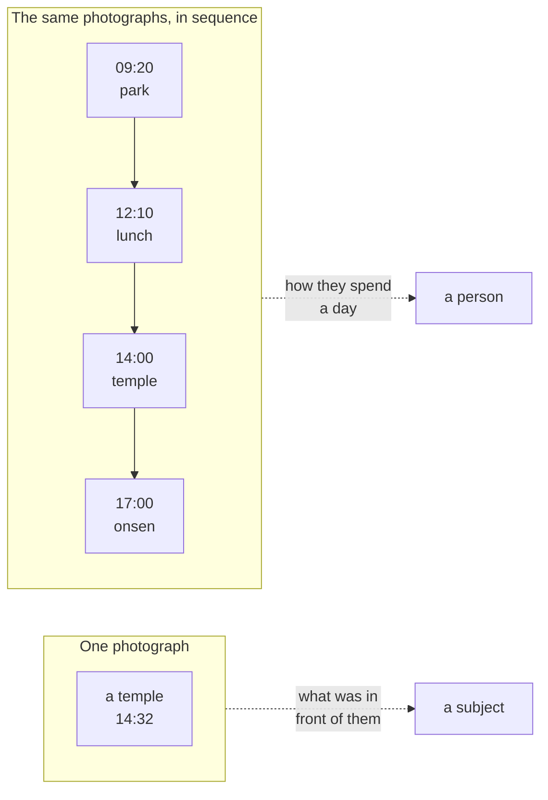
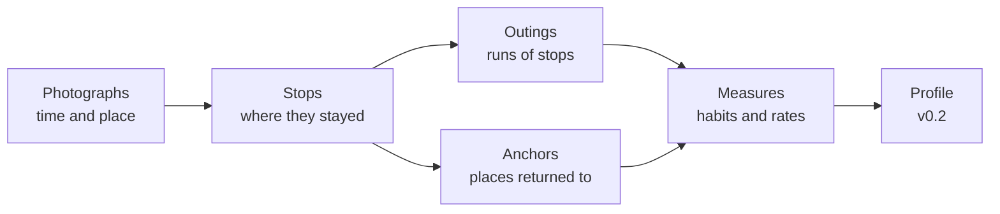
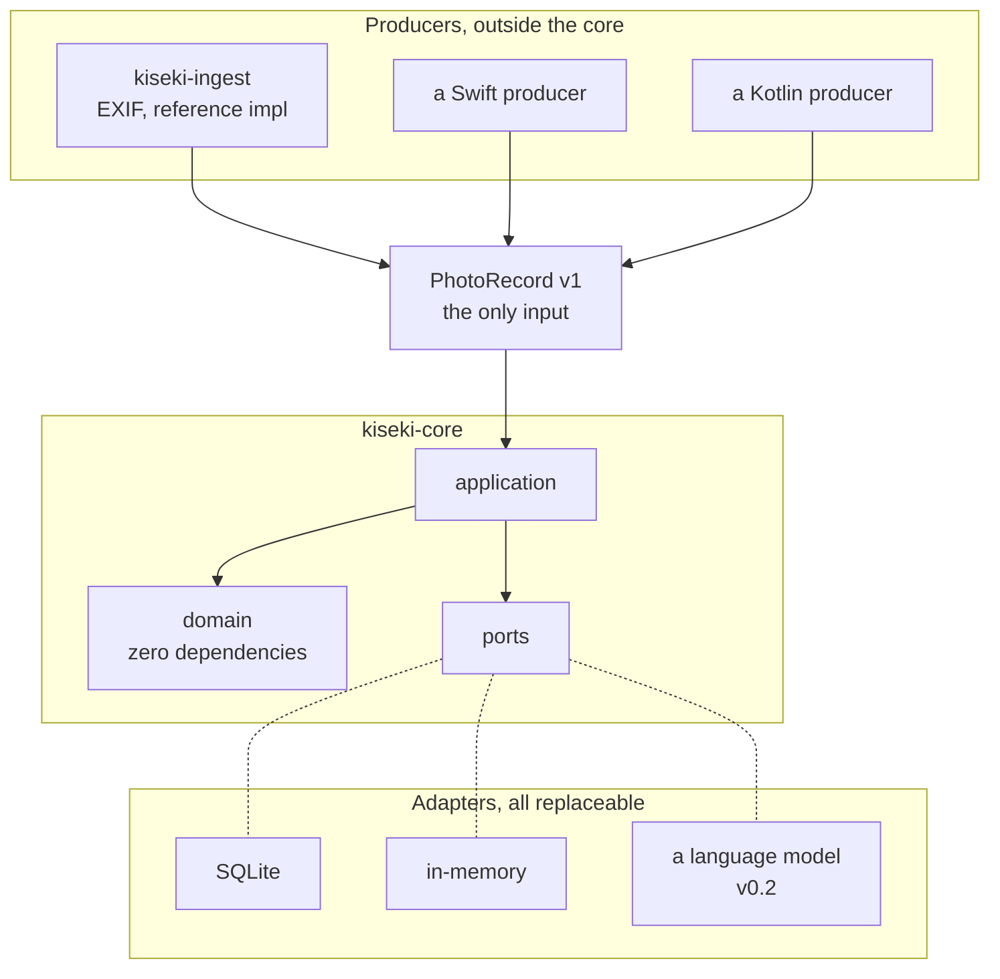
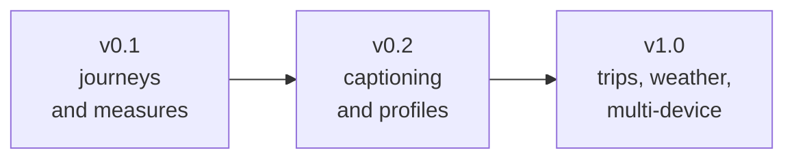

# KISEKI

**Reads a photo library as a sequence, and measures what it says about the
person who made it.**

A Python library. No account, no upload, no network required.

---

## The idea

Ask what a photograph says about someone and you get an answer about its
subject. Ask what a thousand photographs say *in order* and you get an answer
about the photographer.



The second reading is what this library is for. Not *where did they go*, but
*how far do they usually go, how much do they pack into a day, and which places
did they think were worth a second visit*.

---

## What it finds

Given two years of an ordinary photo library, it reports things like:

```
places returned to
  (34.7567, 135.4611)    52 days   304 photos   night   6%  weekday 100%  daytime  90%
  (34.7909, 135.4736)    12 days    61 photos   night   8%  weekday  33%  daytime  75%
  (34.7858, 135.4555)    10 days    94 photos   night  60%  weekday  40%  daytime  30%

distinct places      131
never returned to    85%

distance covered     median  0.0 km    mean  16.7    range 0.0 to 817.1
time out             median  1.0 h     mean   3.1
places per outing    median  1.0       mean   1.9

weekend share        37%
```

You can read those three places without being told which is which. That is
deliberate: the library reports what it observed and assigns no labels, because
the categories that fit one person's life fit the next person's badly.
See [ADR-0012](docs/adr/0012-anchors-are-observations-not-categories.md).

The measure that carries the most is the one time rate. A library where most
places were seen once describes somebody still looking; a low rate describes
somebody who has found what they like. No single photograph contains that.

---

## How it works



A **stop** is a stay in one place, found from photograph density and the speed
implied between shots. Photographs taken through a train window do not become a
series of stops.

An **outing** is a run of stops with no long silence between them.

An **anchor** is anywhere visited on enough separate days to be part of a life,
reported with the shares above and no category.

**Measures** count and summarise. They never interpret; that is v0.2's job, and
keeping the seam sharp is what makes the numbers testable.
See [ADR-0010](docs/adr/0010-separate-measurement-from-interpretation.md).

---

## Architecture



Three commitments, each enforced rather than promised:

**The domain layer depends on nothing.** Not Pillow, not a database, not even
`pathlib`. `kiseki-core` declares no runtime dependencies at all, and
import-linter fails the build if anything creeps in.

**One documented input.** The core never reads EXIF, HEIC, PhotoKit or
MediaStore. It accepts [PhotoRecord v1](docs/photo-record.md), a JSON contract
any program in any language can emit. A
[conformance kit](docs/conformance.md) checks your producer against it, and a
contract forbids the reference producer from importing the core, so the
independence is verified rather than asserted.

**Ports are protocols.** Storage and models are `typing.Protocol`, so an
implementer writes a matching class and never imports this library. One shared
test suite runs against both the fake and the real implementation, so the fake
cannot drift. See [ADR-0004](docs/adr/0004-define-ports-as-protocols.md).

---

## Privacy

The premise requires holding someone's movements for years, so the position is
structural rather than a promise:

- **No coordinate is ever configured.** Home is not a setting; it is inferred,
  or not inferred, from evidence
- **Nothing leaves the machine.** No network call is needed to ingest, build or
  report
- **No personal data in this repository.** Tests build synthetic photographs at
  run time; a pre-commit hook refuses to commit an image or a database
- **Coordinate blurring** is the default in exports and visualisation (v0.2)

---

## Try it

```bash
git clone https://github.com/Nananananana/kiseki
cd kiseki
uv sync --all-packages

# turn a folder of photographs into the input contract
uv run kiseki-ingest ~/photos ~/kiseki-data \
  --owner me --platform ios --default-offset +09:00

# read them, build, and see what they say
uv run kiseki ingest ~/kiseki-data/photo-records.json
uv run kiseki build
uv run kiseki report
```

`kiseki report --json` prints the same measures as a document.
Full reference: [docs/cli.md](docs/cli.md).

---

## Roadmap



| Version | Scope | State |
|---|---|---|
| v0.1 | Stops, outings, anchors, measures, storage, CLI | Current |
| v0.2 | Image captioning, written profiles, suggestions with evidence, REST API, visualisation | Next |
| v1.0 | Overnight trips, weather, several devices merged, incremental rebuilds, PyPI | Planned |

Two things v0.2 owes the design. Roughly a third of an ordinary library is
photographs that form no stop at all: a dish, a shop window, a cat. Those are
complete statements of interest and are currently unused; see
[FR-507](docs/requirements-addendum.md). And every profile statement will carry
the outings it rests on, because a guess about somebody is only useful if they
can check it.

---

## Development

```bash
uv run pytest          # 404 tests, none of which call a model
uv run mypy packages   # strict
uv run lint-imports    # the architecture, as four enforced contracts
```

Built test-first throughout. The
[decision records](docs/adr/) carry the reasoning, including the parts that
turned out wrong: [ADR-0012](docs/adr/0012-anchors-are-observations-not-categories.md)
replaces two earlier attempts that a real photo library broke.

[Contributing](CONTRIBUTING.md) ·
[Ubiquitous language](docs/ubiquitous-language.md) ·
[Context map](docs/context-map.md)

## License

MIT
