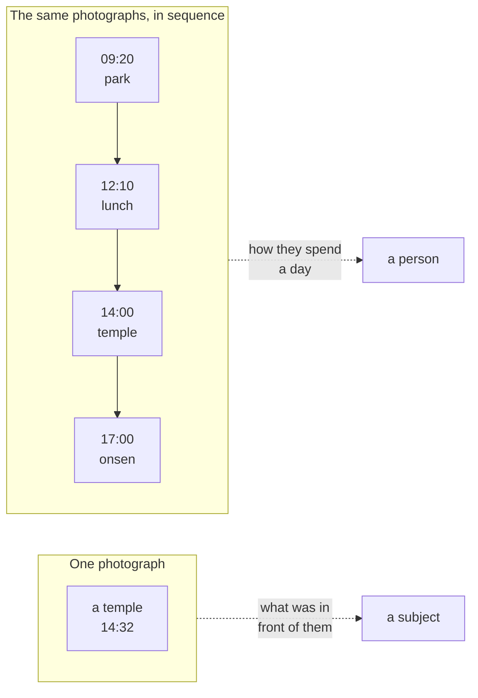
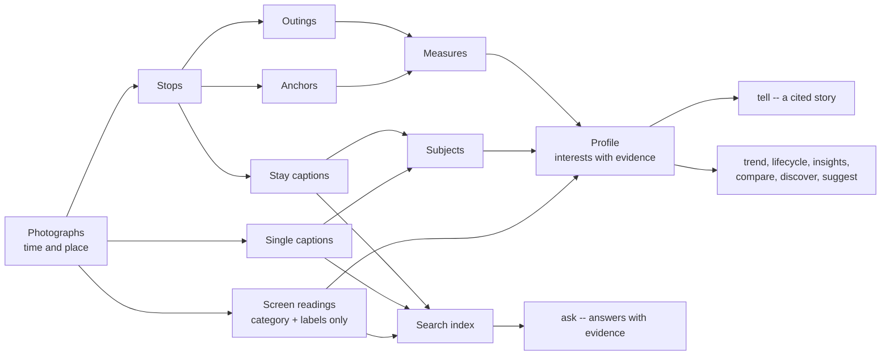
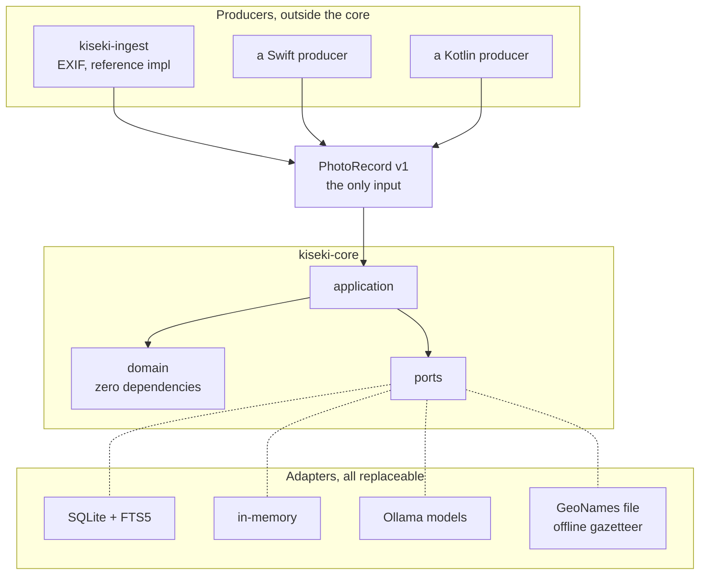

# KISEKI

**A local-first personal context engine: it turns your photo history into
evidence-backed insights about your journeys, your interests, and how they
change over time.**


**No account. No upload. No network required.**

*Kiseki* means "trail" in Japanese: the line your days draw on a map. This
library reads that line -- on your machine, for you alone.

---

## The problem

Your phone holds thousands of photographs, and today's photo AI is good at
them: it searches, classifies, recognises what is in the frame, shows where
it was taken. All of that is about the *photos*.

None of it answers the questions the photos could answer about *you*:

> Where do I keep going back? What do I actually care about? How do I spend
> a free day? What changed since last year -- and why do I think so?

| Traditional photo AI | KISEKI |
|---|---|
| What is in this photo? | What does my photo history say about me? |
| Find this photo | Understand my behaviour |
| Recognise objects | Discover interests |
| Group photos | Reconstruct journeys |
| Search by metadata | Search personal context |
| The current state | Change over time |

Not a replacement for those tools -- a different layer above them.

One photograph tells you about its subject. A sequence tells you about the
photographer. The second reading is what this library is for.



---

## What it says about a real library

Two years of an ordinary phone, read on the machine that holds it:

```text
$ kiseki suggest
  from your own evidence, the most overdue first

    go back    Umeda (JP)          every ~25d, 627 days since   confidence 1.00
    go back    Toyonaka (JP)       every ~4d, 77 days since     confidence 1.00
    day trip   Kyoto (JP)          35 km out, last seen 766 days ago
    day trip   Nara-shi (JP)       29 km out, last seen 745 days ago

  8 in 10 of your outings cover under 49 km; a day trip is measured against that
```

```text
$ kiseki ask "what did you eat in Seoul?" --near "37.56,126.98"
Fried chicken, dumplings, and a Korean BBQ spread of grilled meats and
side dishes around a tabletop grill [F1][F5].

  confidence    0.79
  time range    2026-03-19 to 2026-03-21
  evidence      8
```

```text
$ kiseki drift
  what moved with what
    photographs    and outings      no shared movement   (+0.34)  over 26 months
    outings        and screens      no shared movement   (-0.01)  over 26 months

  moving together is not causing: nothing here says one made the other happen
```

Every number came from that library. Nothing was configured: the day-trip
radius is the distance those outings actually cover, and the places are
ones already visited.

---

## Quick start

```bash
git clone https://github.com/Nananananana/kiseki
cd kiseki
uv sync --all-packages

# see the whole engine on invented data, touching nothing of yours
uv run kiseki demo

# turn a folder of photographs into the input contract
uv run kiseki-ingest ~/photos ~/kiseki-data \
  --owner me --platform ios --default-offset +09:00

# read them, build, and see what they say
uv run kiseki ingest ~/kiseki-data/photo-records.json
uv run kiseki build
uv run kiseki report
```

`kiseki demo` is the fastest way to see what the library does: it builds a
synthetic library in a sandbox, runs every derivation against it, and
sweeps up. It calls no model and reads no configuration.

After that, one command keeps everything current:

```bash
uv run kiseki refresh    # build, read, index, profile, then the doctor
```

Place names need a one-time download
([docs/gazetteer.md](docs/gazetteer.md)); the weekly routine is in
[docs/runbook.md](docs/runbook.md).

---

## What you can do

**Take it in, and keep it current**

```bash
uv run kiseki ingest ...     # read PhotoRecord files
uv run kiseki build          # stops, outings, anchors
uv run kiseki refresh        # the whole routine, idempotent
uv run kiseki doctor         # categorised health checks
```

**Read the photographs** (local models, all resumable)

```bash
uv run kiseki caption        # describe each stay
uv run kiseki singles        # the photographs outside every stay
uv run kiseki screens        # screenshots: category and labels only
uv run kiseki subjects       # name what the captions were about
uv run kiseki themes         # gather the labels into themes
uv run kiseki profile        # read it all as interests (keep weekly)
```

**Ask, and be answered with evidence**

```bash
uv run kiseki ask "..."              # answers that cite their facts
uv run kiseki ask "..." --near "lat,lon" --within-km 20
uv run kiseki tell                   # a cited story, with its doubts named
uv run kiseki index                  # index the readings for search
```

**See what changed, and what is worth a look**

```bash
uv run kiseki trend          # drift between kept profiles
uv run kiseki lifecycle      # new, returned, growing, dormant...
uv run kiseki insights       # the current findings, with evidence
uv run kiseki compare        # what changed between two readings
uv run kiseki discover       # what is worth a look, ranked
uv run kiseki drift          # what moved with what, over months
uv run kiseki places         # what your journeys say per place
uv run kiseki suggest        # go back, pick up, day trip
```

**Correct it, and see what it holds**

```bash
uv run kiseki correct ...    # your word against a reading
uv run kiseki corrections    # the append-only log
uv run kiseki privacy        # how your data is treated, in counts
uv run kiseki trips          # the nights away, as journeys
uv run kiseki forget ...     # remove photographs, and all that spoke
uv run kiseki retention      # what a decade should look like
uv run kiseki export         # the one-way interest export
uv run kiseki reread         # what a newer prompt version left behind
uv run kiseki retry          # refusals the environment caused
uv run kiseki view           # one self-contained HTML page
uv run kiseki serve          # the same answers over local HTTP
```

Full reference: [docs/cli.md](docs/cli.md).

---

## How it works

A **stop** is a stay in one place, found from photograph density and the
speed implied between shots. An **outing** is a run of stops with no long
silence between them. An **anchor** is anywhere visited on enough separate
days to be part of a life. **Measures** count and never interpret
([ADR-0010](docs/adr/0010-separate-measurement-from-interpretation.md));
everything above them interprets, and cites.



---

## Why it is built this way

### Evidence first, and the model last

```text
Evidence -> deterministic measures -> derived profile and insights
         -> LLM narration
```

Local models (via Ollama) describe photographs and phrase answers. They
work over a closed, numbered fact list and must cite it. **The model
explains the evidence; it does not create facts outside it.** Confidence,
time ranges, trends and lifecycles are arithmetic, never model opinions --
and with no evidence there is no model call: "I don't know" is a correct
answer.

The prose is checked afterwards, too. An answer that cites nothing, cites
a fact that does not exist, or names a year the evidence never saw is
reported beside it -- and never rewritten, because the model said what it
said ([ADR-0054](docs/adr/0054-an-answer-is-checked-past-its-schema.md),
[ADR-0057](docs/adr/0057-a-narration-is-checked-against-its-facts.md)).

### You can disagree with it

A reading you reject is appended to a correction log, and every derivation
reads through it: the profile, the trends, the insights, the story, even
the evidence behind an answer. Nothing is rewritten and nothing is lost --
reinstate, and it all comes back
([ADR-0044](docs/adr/0044-corrections-are-appended-applied-at-read.md)).

### Private by design

Your photo history can reveal where you live, where you work, where you
travel, and what you care about. KISEKI treats that as an architectural
constraint, not a feature added later:

- **No coordinate is ever configured.** Home is not a setting; it is
  inferred, or not inferred, from evidence
- **Nothing leaves the machine.** No network call is needed to ingest,
  build, index, ask or report; even place names come from a file you
  download yourself
- **No personal data in this repository.** Tests build synthetic
  photographs at run time; a pre-commit hook refuses images and databases
- **Coordinate blurring is the default** on everything served or written:
  the local API and the HTML view round to about a kilometre unless raw
  output is asked for explicitly
- **Screenshot words are never stored**: a screen reading is a category and
  short labels, with no text field; chat, auth and finance screens are
  never labelled, and consent flags are enforced in code (ADR-0030,
  ADR-0032)
- **Anchors are never named, and names are never stored**: the gazetteer
  resolves place names at display time only, and the served story keeps
  places silent (ADR-0040, ADR-0041)

`kiseki privacy` reports all of it in counts, from your own database.

### Nothing outside can invent a suggestion

A provider -- a weather service, opening hours -- may annotate a
suggestion and may not create one. The port takes suggestions and returns
notes, and there is no return path by which anything could add a
candidate, so "every suggestion comes from your own evidence" is enforced
by a type signature rather than by review
([ADR-0056](docs/adr/0056-a-provider-may-annotate-never-invent.md)).

### Three commitments in the code



**The domain layer depends on nothing.** Not Pillow, not a database, not
even `pathlib`. `kiseki-core` declares no runtime dependencies at all, and
import-linter fails the build if anything creeps in.

**One documented input.** The core never reads EXIF, HEIC, PhotoKit or
MediaStore. It accepts [PhotoRecord v1](docs/photo-record.md), a JSON
contract any program in any language can emit, checked by a
[conformance kit](docs/conformance.md); a contract forbids the reference
producer from importing the core.

**Ports are protocols.** Storage, models and the gazetteer are
`typing.Protocol`; one shared test suite runs against both the fake and the
real implementation, so the fake cannot drift
([ADR-0004](docs/adr/0004-define-ports-as-protocols.md)).

---

## What KISEKI is not

- a replacement for a photo gallery
- a cloud photo backup service
- a social network
- an autonomous personal agent
- a general-purpose computer vision framework

---

## Status

KISEKI is an actively developed early-stage project. The journey
reconstruction and the evidence model are already usable; the personal
context layer is actively evolving, and the API and data model may change
before v1.0.

**Current:** v0.9 -- long years, and what to forget.
**Next:** v0.10 -- more than photographs
([docs/proposals](docs/proposals)).

## Roadmap

```mermaid
flowchart LR
    V1["v0.1<br/>understand<br/>journeys"] --> V2["v0.2<br/>understand<br/>interests"]
    V2 --> V3["v0.3<br/>expand the<br/>evidence"]
    V3 --> V4["v0.4<br/>search personal<br/>context"]
    V4 --> V5["v0.5<br/>discover<br/>insights"]
    V5 --> V6["v0.6<br/>understand change,<br/>suggest"]
    V6 --> V7["v0.7<br/>live<br/>with it"]
    V7 --> V8["v0.8<br/>recommend with<br/>evidence"]
    V8 --> V9["v0.9<br/>devices and<br/>years"]
    V9 --> S1["v0.10<br/>more than<br/>photographs"]
    S1 --> S2["v0.11<br/>the first<br/>new sources"]
    S2 --> S3["v0.12<br/>one question,<br/>the right machine"]
    S3 --> S4["v0.13<br/>your<br/>rhythm"]
    S4 --> V10["v1.0<br/>personal context<br/>engine"]
```



| Version | Value | State |
|---|---|---|
| v0.1 | Understand journeys: stops, outings, anchors, honest measures | Released |
| v0.2.x | Understand interests: captions, profiles, themes, trend, API, view | Released |
| v0.3 | Expand the evidence: screenshots without their words, mechanical consent | Released |
| v0.4 | Search personal context: `ask` with evidence, temporal questions, named places, lifecycles | Released |
| v0.5 | Discover insights: findings with evidence, corrections that reach every derivation, comparisons with reasons, privacy dashboard, interest export | Released |
| v0.6 | Understand change and suggest: discovery feed, mixed evidence, place intelligence, evidence-based `suggest`, retrieval provenance, a golden retrieval dataset in CI | Released |
| v0.7 | Live with it: one `kiseki refresh`, prompt-version tracking with `reread`, recoverable refusals with `retry`, findings in the view, label and cadence calibration, answers checked past their schema | Released |
| v0.8 | Recommend with evidence: `kiseki demo`, day trips measured against your own distances, the provider boundary, cross-timeline drift with no causal claim, the narration check | **Released** |
| v0.9 | Long years, and what to forget: the privacy promises checked by machine, overnight trips, deletion that reaches everything that spoke, retention as rules you can leave off | **Released** |
| v0.10 | More than photographs, the boundary: records as siblings (PhotoRecord v1 frozen), the new-source checklist as a gate, provenance graphs, per-source privacy counts | Planned |
| v0.11 | The first new sources: web pages and watched videos read into categories and labels, the text discarded at ingest; cross-source retrieval and one profile from several kinds of witness | Planned |
| v0.12 | One question, the right machine: questions routed to the derivation that can answer them, `kiseki now` in place of six commands, evidence from several kinds of witness at once | Planned |
| v0.13 | Your rhythm: a typical week and month from whatever sources exist, departures named and never judged, where trips, places and drift turn out to be one subject | Planned |
| v1.0 | Public: PyPI, a frozen API, hardened conformance, a security pass over serve | Planned |

The versions climb a longer ladder: **Phase 0** measure the trail (done),
**Phase 1** understand yourself (done), **Phase 2** recommendations with
evidence (v0.8 onward), **Phase 3** an anonymous interest community,
**Phase 4** an interest graph. Direction and decisions:
[proposals/0007](docs/proposals/0007-the-road-to-v1-0.md).

Every source may be absent. A derivation declares what it can read,
works with any subset of it, and names the sources its answer came
from; a test matrix removes each source in turn and fails the build if
anything requires one. A library with photographs alone behaves exactly
as it does today.
Two things are deliberately *not* built, each waiting for a measurement
rather than an opinion: the incremental build (a full build takes 0.3
seconds at five thousand photographs) and a vector extension (retrieval is
measured by a golden dataset in CI). Both have a written trigger.

---

## Documentation

Start with [docs/README.md](docs/README.md): it says what each document is
for, and keeps three things apart -- what is true now, why it became true,
and what might become true.

- [Architecture](docs/architecture.md), [concept](docs/concept.md),
  [context map](docs/context-map.md),
  [ubiquitous language](docs/ubiquitous-language.md)
- [CLI reference](docs/cli.md), [runbook](docs/runbook.md),
  [gazetteer](docs/gazetteer.md)
- [PhotoRecord v1](docs/photo-record.md) and the
  [conformance kit](docs/conformance.md)
- [Architecture decisions](docs/adr) -- 58 ADRs, including the ones later
  reversed; the reasoning lives here
- [Proposals](docs/proposals) and [release notes](docs/releases)

## License

MIT. Place names come from [GeoNames](https://www.geonames.org/) data
(CC BY 4.0), downloaded by the user and never bundled.
