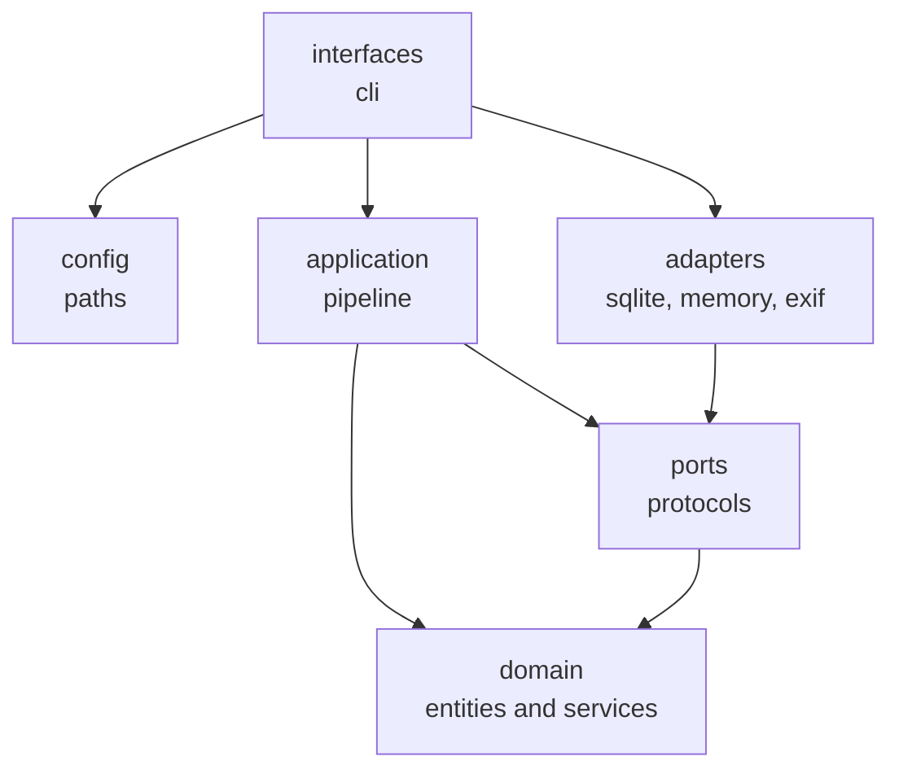
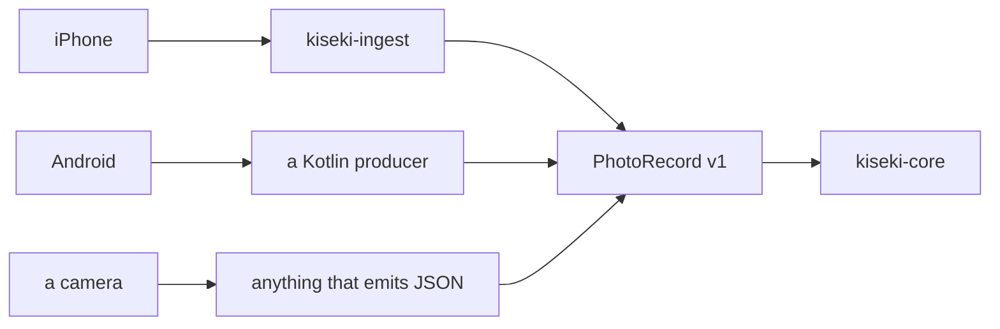
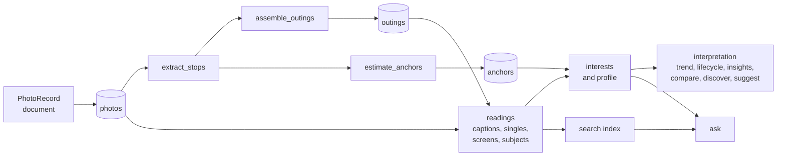

# Architecture

> This describes the current architecture. Decisions are recorded in
> `docs/adr/`; proposed changes in `docs/proposals/`.

## Layers

Dependencies point inward. The domain layer at the centre imports nothing from
the standard library beyond `dataclasses`, `datetime`, `math`, `enum`,
`hashlib`, `statistics` and the typing and collections protocols, and
nothing from outside it at all.

Four contracts in `.importlinter` enforce this, and run in CI:

| Contract | Rule |
|---|---|
| Layer dependency direction | interfaces above config above adapters above application above ports above domain |
| Domain purity | the domain imports no external library |
| Domain has no I/O | the domain imports no `pathlib`, `os`, `tomllib` or config |
| Ingest independence | the reference producer imports no core domain |

The last one is what makes the platform independence real rather than claimed.

## Packages

| Package | Contains | Depends on |
|---|---|---|
| `kiseki-core` | domain, application, ports, adapters, CLI | nothing at runtime |
| `kiseki-ingest` | EXIF reader, reference producer | Pillow |
| `kiseki-conformance` | contract test kit for producers | jsonschema |

Optional adapters ship as extras, so `pip install kiseki` pulls in nothing.

## The input boundary

The core reads one format and no files. Thumbnails are referenced by a relative
string, resolved through a port, so moving storage between drives is a
configuration change with no data migration.

See [ADR-0002](adr/0002-photorecord-as-the-only-input-contract.md).

## Data flow

Readings accumulate and resume; interests and everything past them are
derived on demand, through the correction log. Nothing between
`readings` and `ask` is stored except the search index and the profiles
the owner chooses to keep.

Photographs accumulate. Outings and anchors are derived, and are replaced
wholesale on every rebuild rather than amended, because adding one photograph
can merge two outings or split a third.

See [ADR-0013](adr/0013-derived-data-is-replaced-not-amended.md).

## Testing

| Layer | What it covers | Runs in CI |
|---|---|---|
| unit | domain, config, application, CLI | yes, in seconds |
| contract | one suite applied to both the fake and the real adapter | yes |
| integration | anything calling a real model, marked `llm` | no |

The application layer is tested entirely against fakes: no database, no
filesystem, no model. That is why the ports exist.

Two suites exist to catch what unit tests cannot. The golden retrieval
dataset (`tests/golden/retrieval.json`) states, for fixed corpora, which
documents a question must return; it needs no model and runs in CI, and
it has already caught two ways a filtered question could be starved.
The answer check (ADR-0054) validates a model's reply against the
evidence it was given, so a prompt change that starts inventing
citations is visible.

## Decision records

Every non-obvious choice is written down in [adr/](adr/), including the ones
that were later reversed. ADR-0009 and ADR-0011 remain in the repository,
superseded by ADR-0012, because the reasoning that failed is as useful as the
reasoning that held.
