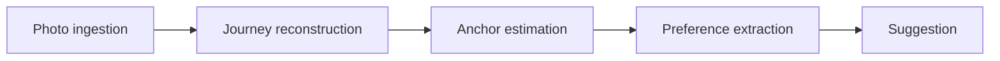

# Context map

Five bounded contexts, arranged as a one-way pipeline. Each context translates
what it receives into its own vocabulary rather than reusing the upstream model.

## Contexts

| Context | Responsibility | Aggregates |
|---|---|---|
| Photo ingestion | Validate the input contract, normalise records, exclude non-photographic content | Photo |
| Journey reconstruction | Extract stops, assemble outings, detect trips, produce impressions and narratives | Outing, Trip |
| Anchor estimation | Identify anchors and classify the rest as destinations | Anchor |
| Preference extraction | Derive profiles and analytics over a period | PreferenceProfile |
| Suggestion | Search and generate proposals with evidence | Suggestion |

## Relationships

All relationships are upstream to downstream, conformist in direction but
translated at the boundary.

| Upstream | Downstream | What crosses the boundary |
|---|---|---|
| Photo ingestion | Journey reconstruction | Validated `Photo` records only |
| Journey reconstruction | Anchor estimation | `Outing` with stop centroids and time ranges |
| Anchor estimation | Journey reconstruction | `Anchor` areas, used to determine outing boundaries |
| Anchor estimation | Preference extraction | `Anchor` and `Destination` classification |
| Journey reconstruction | Preference extraction | `Outing` including narratives |
| Preference extraction | Suggestion | `PreferenceProfile` and analytics |

Preference extraction does not know that photos exist. It works only with
outings. This is deliberate: it keeps the number of photos in a stop out of the
preference model, where it would act as an accidental weight.

## The one cycle

Anchor estimation and journey reconstruction depend on each other. Outing
boundaries are defined by leaving and returning to an anchor, but anchors are
estimated from where stops concentrate.

This is resolved by running two passes rather than by introducing a cyclic
dependency in code:

1. Estimate provisional anchors from stop density alone
2. Assemble outings using those anchors
3. Re-estimate anchors from the assembled outings
4. Reassemble outings

Both passes call the same pure domain services with different inputs.

## What lives outside every context

The input contract itself. `PhotoRecord v1` is not owned by photo ingestion; it
is a published schema that producers and the library both conform to. See
ADR-0002.
