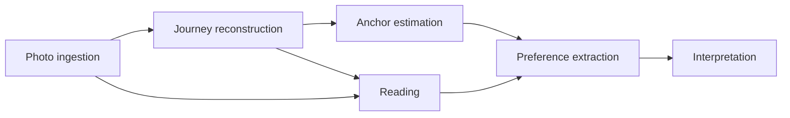

# Context map

> This describes the current boundaries of responsibility. Decisions
> are recorded in `docs/adr/`; proposed changes in `docs/proposals/`.

Six bounded contexts, arranged as a one-way pipeline. Each context
translates what it receives into its own vocabulary rather than reusing
the upstream model.

## Contexts

| Context | Responsibility | Aggregates |
|---|---|---|
| Photo ingestion | Validate the input contract, normalise records, honour consent, exclude non-photographic content from journeys | PhotoObservation |
| Journey reconstruction | Extract stops, assemble outings, measure rhythm and reach | Stop, Outing |
| Anchor estimation | Identify anchors and classify the rest as destinations | Anchor |
| Reading | Turn images and screens into words: stay captions, single captions, screen readings, subject labels, themes | Caption, SingleCaption, ScreenshotReading, SubjectExtraction, ThemeSet |
| Preference extraction | Derive interests and profiles from readings and journeys, through corrections | Interest, Profile |
| Interpretation | Trends, lifecycles, insights, comparisons, discovery, places, suggestions, and answers with evidence | TrendReport, InsightReport, Comparison, DiscoveryFeed, Suggestion, Answer |

## Relationships

All relationships are upstream to downstream, conformist in direction
but translated at the boundary.

| Upstream | Downstream | What crosses the boundary |
|---|---|---|
| Photo ingestion | Journey reconstruction | Validated observations that may shape journeys (ADR-0028) |
| Photo ingestion | Reading | Observations the owner permits to inform preferences (ADR-0032) |
| Journey reconstruction | Anchor estimation | Outings with stop centroids and time ranges |
| Anchor estimation | Journey reconstruction | Anchor areas, used to determine outing boundaries |
| Journey reconstruction | Reading | The photographs of a stay, for one caption per stay |
| Reading | Preference extraction | Labels and themes, keyed by caption or photograph |
| Anchor estimation | Preference extraction | Place visits that are not anchors |
| Preference extraction | Interpretation | Profiles, kept over time |

Preference extraction reads two kinds of evidence and keeps them
distinct: the journeys, which say where somebody chose to be, and the
readings, which say what was in front of them. A single photograph that
formed no stop still speaks (FR-507): the two readings are combined in
the profile and never merged into one another, so a photograph of lunch
never becomes a journey.

## The one cycle

Anchor estimation and journey reconstruction depend on each other.
Outing boundaries are defined by leaving and returning to an anchor, but
anchors are estimated from where stops concentrate. This is resolved by
running two passes rather than by introducing a cyclic dependency in
code:

1. Estimate provisional anchors from stop density alone
2. Assemble outings using those anchors
3. Re-estimate anchors from the assembled outings
4. Reassemble outings

Both passes call the same pure domain services with different inputs.

## What lives outside every context

The input contract itself. `PhotoRecord v1` is not owned by photo
ingestion; it is a published schema that producers and the library both
conform to (ADR-0002). The interest export (ADR-0047) is its mirror at
the other end: the most that ever leaves, versioned.
