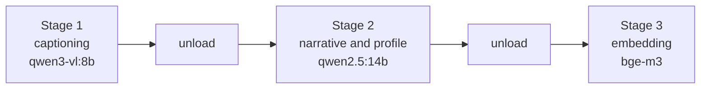

# Models

v0.2 introduces the first components that cannot be tested by assertion. This
page records which models the defaults target, why, and what the hardware
allows. Every one of them is replaceable: they reach the core through ports, so
nothing here is baked in.

## Reference configuration

Chosen for a single 16 GB consumer card, entirely local, no account required.

| Role | Model | Size | Why |
|---|---|---|---|
| Captioning | `qwen3-vl:8b` | 6.1 GB | Strong Japanese, 256K context, Apache 2.0, fits alongside nothing else |
| Narrative and profile | `qwen2.5:14b-instruct-q4_K_M` | 9.0 GB | Better long-form writing than an 8B; already in use on this machine |
| Tool calling | `llama3.1:8b` | 4.9 GB | Qwen2.5 quantised does not reliably return tool calls |
| Embedding | `bge-m3` | 1.2 GB | 1024 dimensions, 8192 tokens, 100+ languages, good on Japanese |

Alternatives worth trying: `gemma4:12b` for narrative, `qwen3:8b` where speed
matters more than prose quality.

## Memory

16 GB of VRAM does not hold the captioning model and the 14B at once. The
pipeline is therefore staged in time rather than run as one pass:



Stage one is the long one and belongs overnight. Stages two and three run in
minutes over the output of stage one.

Ollama keeps a model resident after use. Set `keep_alive` to a short value, or
zero between stages, to avoid the second model failing to load because the first
has not been released.

```python
{"model": "qwen3-vl:8b", "keep_alive": "5m"}
```

## Cost of a captioning run

Captioning every photograph is prohibitive; captioning a few representative
images per stop is not. For a library of around 3,500 photographs producing
roughly 270 stops:

| Quantity | Value |
|---|---|
| Photographs | ~3,500 |
| Stops | ~270 |
| Representative images per stop | 3 to 5 |
| Images actually captioned | ~1,000 |
| Rough time on an RTX 4070 Ti Super | 1 to 2 hours |

That ratio is the point of doing sequence analysis before content analysis: the
structure decides what is worth looking at.

## Why these choices are not in the code

Every model reaches the core through a port. `ImageCaptioner`, `LanguageModel`
and `TextEmbedder` are protocols, so a user can point the library at a hosted
API, a different local model, or something that does not exist yet, without this
repository knowing.

The defaults above are what the project is developed and evaluated against, and
nothing more.

## Hardware this was developed on

| Component | Specification |
|---|---|
| GPU | RTX 4070 Ti Super, 16 GB |
| CPU | Intel Core i7-14700F |
| Memory | 64 GB |
| OS | Windows 11 Pro |
| Runtime | Ollama 0.32.6 |

Smaller cards will work with smaller models; the ports exist so that this is a
configuration question. Nothing in the library assumes a GPU is present at all,
and the whole of v0.1 runs without one.

## Evaluating what cannot be asserted

Captions, narratives and profiles are not deterministic, so they are held to a
different standard from the measures:

| Kind | How it is checked |
|---|---|
| Measures | Exact assertions, in CI, in milliseconds |
| Port behaviour | One contract suite, run against the fake and the real adapter |
| Model output | A held-out set of stops with known content, scored by a judging model |

Tests that call a real model are marked `llm` and excluded from CI, which has no
GPU. They are run locally and deliberately.
